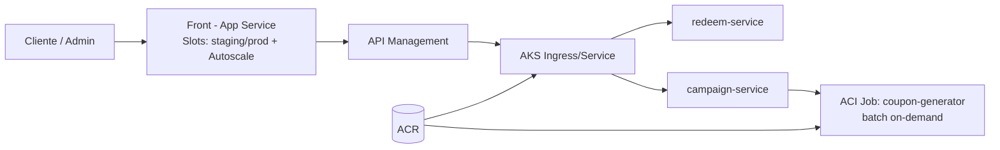

# Caso de Estudio: Campaña de Cupones Promocionales (Generación + Canje)

## Contexto

- Marketing lanza campañas con cupones (por ejemplo: “10% OFF”).
- Hay picos cuando:
    - Se publica la campaña (muchos canjes simultáneos)
    - Se necesita generar miles de cupones nuevos para otra campaña (operación puntual)

## Objetivo

Construir una solución mínima compuesta por:
- **Front:** Para canjear cupones (cliente) y panel admin para activar campañas y solicitar generación masiva.
- **Backend:** Para validar/canjear cupones con control de fraude (mínimo viable).
- **Componente elástico:** Para generación masiva, sin sobredimensionar AKS.

---

## Tecnología y Plataforma

- **Plataforma Cloud:** Toda la solución será construida y desplegada en **Microsoft Azure**.
- **Orquestación de Infraestructura:** La creación y gestión de la infraestructura en Azure se realizará utilizando **Terraform**.
- **Framework principal:** .NET 8 será utilizado tanto para el desarrollo del **Front** como para el **Back**.
    - El **Front** será una SPA simple desarrollada con [ASP.NET Core Blazor o ASP.NET Core](https://learn.microsoft.com/dotnet/core/whats-new/dotnet-8).
    - El **Back** (microservicios, API y lógica de negocio) será desarrollado también en **.NET 8**.
- **Repositorios:**
    - Se crearán repositorios independientes para cada componente clave:
        - **Repositorio de Infraestructura:** Contendrá el código Terraform para desplegar todos los servicios y recursos en Azure (App Service, APIM, AKS, ACR, ACI, redes, etc.).
        - **Repositorio de Backend:** Contendrá el código fuente de los microservicios y lógica de negocio.
        - **Repositorio de Frontend:** Contendrá el código fuente de la SPA/lógica frontend.
        - **Repositorio de APIs:** Puede existir como repositorio separado para la definición y documentación de las APIs (por ejemplo, OpenAPI/Swagger), ó puede integrarse dentro del Backend según la preferencia del equipo.

---

## Componentes Obligatorios y su Rol

### 1) Front: Azure App Service (Slots + Autoscale)
- Hospeda el front web (SPA simple) en .NET 8.
- **Slots:** staging y production para despliegue sin downtime (swap).
- **Autoscale:** escala instancias para absorber picos de canje.

### 2) Gateway: Azure API Management (APIM)
- Punto único de entrada para el front:
    - `POST /redeem` (canje)
    - `GET /coupon/{code}` (consulta)
    - `POST /campaigns/{id}/generate` (generación masiva)
- **Políticas mínimas:**
    - JWT/OAuth2 (admin vs cliente)
    - Rate limiting / cuota por IP o suscripción
    - Versionado

### 3) Backend: AKS
- Microservicios mínimos (2), ambos en .NET 8:
    - **redeem-service:** valida cupón, aplica reglas, registra el canje.
    - **campaign-service:** administra campañas y solicita generación masiva.
- Escala con HPA (pods) y cluster autoscaler (nodos, opcional).

### 4) Procesamiento Burst: Azure Container Instances (ACI)
- Job on-demand: **coupon-generator**, desarrollado en .NET 8.
- Genera N cupones (ejemplo: 100k), aplica formato, evita colisiones, retorna/almacena el resultado (ejemplo: archivo o inserciones masivas).
- Absorbe carga puntual sin reservar capacidad AKS de forma permanente.

### 5) Registry: Azure Container Registry (ACR)
- Almacena imágenes Docker para:
    - redeem-service
    - campaign-service
    - coupon-generator (ACI job)
- AKS y ACI consumen imágenes desde ACR.

---

## Flujo Simple (Runtime)

### A) Canje (pico de campaña)
1. Usuario entra al Front (App Service).
2. Front llama a APIM: `POST /redeem` con `{ couponCode, userId }`.
3. APIM enruta a AKS → redeem-service.
4. redeem-service valida (existencia, vigencia, límite por usuario, etc.) y confirma el canje.

### B) Generación Masiva (operación puntual)
1. Admin entra al front y solicita: “Generar 50,000 cupones”.
2. Front → APIM: `POST /campaigns/{id}/generate`.
3. APIM → AKS campaign-service.
4. campaign-service lanza un ACI job coupon-generator.
5. El job genera los cupones y reporta resultado (cantidad, duplicados, etc.) al campaign-service.

---

## Diagrama (Mermaid)



---

## Alcance Mínimo del Laboratorio (Muy Simple)

- **Front** con 2 pantallas:
    - Canjear cupón
    - Admin: generar cupones + ver estado
- **APIM** con 3 endpoints: canjear, consultar cupón, generar.
- **AKS** con 2 deployments: redeem-service y campaign-service.
- **ACI** job que genera cupones “dummy” (por ejemplo, GUIDs con prefijo y checksum simple).
- **ACR** con 3 imágenes y pull desde AKS/ACI.
- **App Service:**
    - Slot staging + swap a production
    - Autoscale habilitado (regla mínima)
- **Repositorios:**
    - Infraestructura (Terraform)
    - Backend (.NET 8)
    - Frontend (.NET 8)
    - APIs/OpenAPI (opcional o incluido en Backend)

---

### Siguientes ejemplos (elige uno para otro caso rápidamente):

- “Reservas de citas con generación de agenda masiva (ACI)”
- “Importación masiva de CSV (ACI) + consulta API (AKS)”
- “Acortador de URLs con generación batch de links de campaña (ACI)”


ya esta creado los repositorios
PowerShell 7.5.4
PS C:\Windows\System32> # Instala GitHub CLI si no la tienes:  https://cli.github.com/
PS C:\Windows\System32>
PS C:\Windows\System32> # Autentícate
PS C:\Windows\System32> gh auth login
? Where do you use GitHub? GitHub.com
? What is your preferred protocol for Git operations on this host? HTTPS
? Authenticate Git with your GitHub credentials? Yes
? How would you like to authenticate GitHub CLI? Login with a web browser

! First copy your one-time code: 3A63-AA33
Press Enter to open https://github.com/login/device in your browser...
PS C:\Windows\System32>
PS C:\Windows\System32> # Crea los 4 repositorios con un solo comando cada uno
PS C:\Windows\System32> gh repo create ImTronick2025/coupons-infrastructure-terraform --public --description "Infrastructure as Code (Terraform) for Coupons Campaign System on Azure"
To get started with GitHub CLI, please run:  gh auth login
Alternatively, populate the GH_TOKEN environment variable with a GitHub API authentication token.
PS C:\Windows\System32>
PS C:\Windows\System32> gh repo create ImTronick2025/coupons-backend-dotnet --public --description "Backend microservices (. NET 8) for Coupons Campaign System"
To get started with GitHub CLI, please run:  gh auth login
Alternatively, populate the GH_TOKEN environment variable with a GitHub API authentication token.
PS C:\Windows\System32>
PS C:\Windows\System32> gh repo create ImTronick2025/coupons-frontend-dotnet --public --description "Frontend SPA (.NET 8) for Coupons Campaign System"
To get started with GitHub CLI, please run:  gh auth login
Alternatively, populate the GH_TOKEN environment variable with a GitHub API authentication token.
PS C:\Windows\System32>
PS C:\Windows\System32> gh repo create ImTronick2025/coupons-apis --public --description "API contracts and OpenAPI documentation for Coupons Campaign System"
To get started with GitHub CLI, please run:  gh auth login
Alternatively, populate the GH_TOKEN environment variable with a GitHub API authentication token.
PS C:\Windows\System32> gh auth login
? Where do you use GitHub? GitHub.com
? What is your preferred protocol for Git operations on this host? HTTPS
? Authenticate Git with your GitHub credentials? Yes
? How would you like to authenticate GitHub CLI? Login with a web browser

! First copy your one-time code: 1F48-1F91
Press Enter to open https://github.com/login/device in your browser...
✓ Authentication complete.
- gh config set -h github.com git_protocol https
✓ Configured git protocol
✓ Logged in as ImTronick2025
PS C:\Windows\System32> gh repo create ImTronick2025/coupons-infrastructure-terraform --public --description "Infrastructure as Code (Terraform) for Coupons Campaign System on Azure"
✓ Created repository ImTronick2025/coupons-infrastructure-terraform on github.com
  https://github.com/ImTronick2025/coupons-infrastructure-terraform
PS C:\Windows\System32>
PS C:\Windows\System32> gh repo create ImTronick2025/coupons-backend-dotnet --public --description "Backend microservices (. NET 8) for Coupons Campaign System"
✓ Created repository ImTronick2025/coupons-backend-dotnet on github.com
  https://github.com/ImTronick2025/coupons-backend-dotnet
PS C:\Windows\System32>
PS C:\Windows\System32> gh repo create ImTronick2025/coupons-frontend-dotnet --public --description "Frontend SPA (.NET 8) for Coupons Campaign System"
✓ Created repository ImTronick2025/coupons-frontend-dotnet on github.com
  https://github.com/ImTronick2025/coupons-frontend-dotnet
PS C:\Windows\System32>
PS C:\Windows\System32> gh repo create ImTronick2025/coupons-apis --public --description "API contracts and OpenAPI documentation for Coupons Campaign System"# Instala GitHub CLI
✓ Created repository ImTronick2025/coupons-apis on github.com
  https://github.com/ImTronick2025/coupons-apis
PS C:\Windows\System32>

este es de local

PS D:\CLOUDSOLUTIONS\cupones> dir
PS D:\CLOUDSOLUTIONS\cupones>


PS D:\CLOUDSOLUTIONS\cupones\coupons-infrastructure-terraform> copilot

 Welcome to GitHub Copilot CLI
 Version 0.0.369 · Commit 83653a1

 Copilot can write, test and debug code right from your terminal. Describe a task to get started or enter ? for help.
 Copilot uses AI, check for mistakes.

 ● Logged in as user: ImTronick2025

 ● Connected to GitHub MCP Server

 D:\CLOUDSOLUTIONS\cupones\coupons-infrastructure-terraform                                               gpt-4.1 (0x)
 ──────────────────────────────────────────────────────────────────────────────────────────────────────────────────────
 >  Enter @ to mention files or / for commands
 ──────────────────────────────────────────────────────────────────────────────────────────────────────────────────────
 Ctrl+c Exit · Ctrl+r Expand recent
‌
genera el codigo para el backend

# Contratos de API - Campaña de Cupones Promocionales

## Especificación: OpenAPI 3.0 (API FIRST)
Este documento plasma los contratos mínimos requeridos para la solución descrita, separados por recurso/endpoint. Asume autenticación JWT/OAuth2 como se indica en el flujo. Los ejemplos están en YAML siguiendo OpenAPI 3.0.

---

## /redeem - Canje de cupón

```yaml
/redeem:
  post:
    summary: Canjear un cupón promocional
    tags:
      - coupons
    security:
      - bearerAuth: []
    requestBody:
      required: true
      content:
        application/json:
          schema:
            type: object
            required: [couponCode, userId]
            properties:
              couponCode:
                type: string
                example: CUPON10OFF
              userId:
                type: string
                example: "user-12345"
    responses:
      '200':
        description: Canje realizado correctamente
        content:
          application/json:
            schema:
              type: object
              properties:
                redeemed:
                  type: boolean
                  example: true
                couponCode:
                  type: string
                  example: CUPON10OFF
                message:
                  type: string
                  example: "Cupón canjeado exitosamente"
                campaignId:
                  type: string
                  example: "CAMPAIGN-2025-BlackFriday"
      '400':
        description: Error de validación (cupón inválido, vencido, ya canjeado, etc.)
        content:
          application/json:
            schema:
              $ref: '#/components/schemas/ErrorResponse'
      '401':
        description: No autenticado
      '429':
        description: Límite de tasa excedido
```

---

## /coupon/{code} - Consulta estado de cupón

```yaml
/coupon/{code}:
  get:
    summary: Consultar estado/detalle de cupón
    tags:
      - coupons
    security:
      - bearerAuth: []
    parameters:
      - in: path
        name: code
        schema:
          type: string
        required: true
        description: Código del cupón a consultar
    responses:
      '200':
        description: Estado y detalles del cupón
        content:
          application/json:
            schema:
              type: object
              properties:
                couponCode:
                  type: string
                  example: CUPON10OFF
                valid:
                  type: boolean
                  example: true
                redeemed:
                  type: boolean
                  example: false
                expiresAt:
                  type: string
                  format: date-time
                  example: 2025-12-31T23:59:59Z
                campaignId:
                  type: string
                  example: "CAMPAIGN-2025-BlackFriday"
                assignedTo:
                  type: string
                  nullable: true
                  example: "user-12345"
      '404':
        description: Cupón no encontrado
        content:
          application/json:
            schema:
              $ref: '#/components/schemas/ErrorResponse'
      '401':
        description: No autenticado
      '429':
        description: Límite de tasa excedido
```

---

## /campaigns/{id}/generate - Solicitar generación masiva de cupones

```yaml
/campaigns/{id}/generate:
  post:
    summary: Solicitar generación masiva de cupones para una campaña
    tags:
      - campaigns
    security:
      - bearerAuth: []
    parameters:
      - in: path
        name: id
        schema:
          type: string
        required: true
        description: ID de campaña
    requestBody:
      required: true
      content:
        application/json:
          schema:
            type: object
            required: [amount, prefix]
            properties:
              amount:
                type: integer
                example: 100_000
                minimum: 1
                maximum: 1_000_000
              prefix:
                type: string
                example: BF25
              expiration:
                type: string
                format: date-time
                example: 2025-12-31T23:59:59Z
    responses:
      '202':
        description: Solicitud de generación aceptada (procesamiento asíncrono)
        content:
          application/json:
            schema:
              type: object
              properties:
                requestId:
                  type: string
                  example: "gen-req-abcdef"
                amount:
                  type: integer
                  example: 100000
                campaignId:
                  type: string
                  example: "CAMPAIGN-2025-BlackFriday"
                status:
                  type: string
                  enum: [pending, running, completed, failed]
                  example: pending
      '400':
        description: Error de validación
        content:
          application/json:
            schema:
              $ref: '#/components/schemas/ErrorResponse'
      '401':
        description: No autenticado (requiere rol admin)
      '403':
        description: No autorizado
      '429':
        description: Límite de tasa excedido
```

---

## Componentes (schemas, security):

```yaml
components:
  securitySchemes:
    bearerAuth:
      type: http
      scheme: bearer
      bearerFormat: JWT
  schemas:
    ErrorResponse:
      type: object
      properties:
        error:
          type: string
          example: "INVALID_COUPON"
        message:
          type: string
          example: "El cupón ingresado no es válido o ya ha sido canjeado."
```

---

> **Notas:**
> - Todos los endpoints se exponen por API Management. El securityScheme sugiere autenticación JWT por OAuth2 (Bearer). Puede ampliarse según grupos (rol admin vs usuario).
> - La respuesta de generación es asíncrona (202 Accepted) y debería administrarse un endpoint adicional para consultar el estado del proceso si se requiere (no obligatorio en alcance mínimo).
> - El endpoint `/coupon/{code}` puede ser consumido tanto por cliente como admin para verificar estado de cupón.
> - Los errores siguen patrón común de error/message.
> - Agregar `x-api-version` como header sugerido en requests/responses para versionado explícito a través de API Management.


por favor con la informacion anterior hay que crear el squema de base de datos
se esta creado una base de dato azure sql data base
