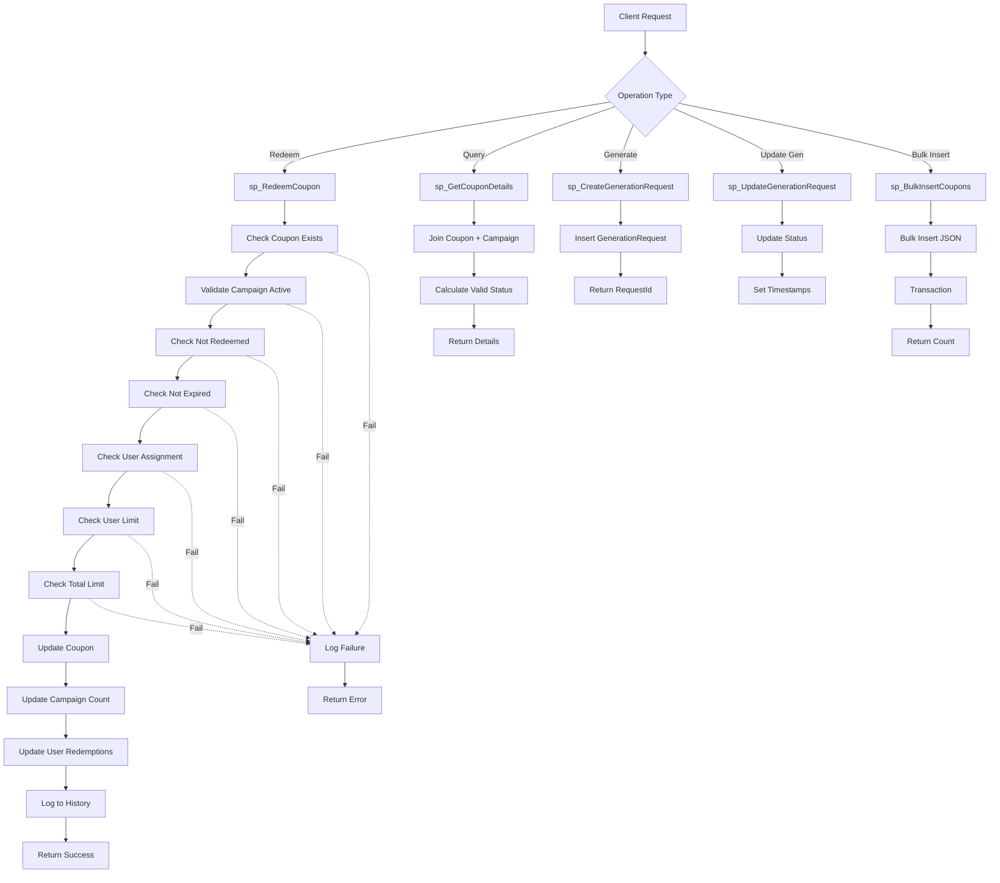
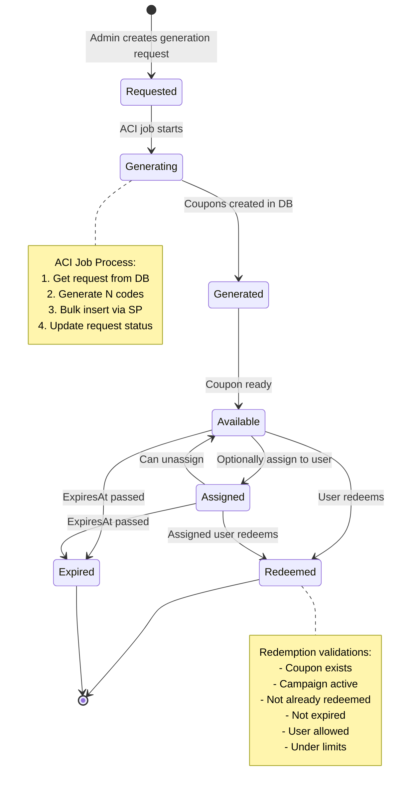

# Database Schema Diagram

```mermaid
erDiagram
    Campaigns ||--o{ Coupons : "has"
    Campaigns ||--o{ GenerationRequests : "requests"
    Campaigns ||--o{ UserRedemptions : "tracks"
    Coupons ||--o{ RedemptionHistory : "attempts"
    
    Campaigns {
        nvarchar(100) CampaignId PK
        nvarchar(200) Name
        nvarchar(1000) Description
        datetime2 StartDate
        datetime2 EndDate
        decimal(5,2) DiscountPercentage
        decimal(10,2) DiscountAmount
        int MaxRedemptionsPerUser
        int MaxTotalRedemptions
        int CurrentRedemptions
        bit IsActive
        datetime2 CreatedAt
        datetime2 UpdatedAt
        nvarchar(100) CreatedBy
    }
    
    Coupons {
        bigint CouponId PK
        nvarchar(50) CouponCode UK
        nvarchar(100) CampaignId FK
        bit IsRedeemed
        datetime2 RedeemedAt
        nvarchar(100) RedeemedBy
        datetime2 ExpiresAt
        nvarchar(100) AssignedTo
        nvarchar(100) GenerationBatchId
        datetime2 CreatedAt
    }
    
    RedemptionHistory {
        bigint RedemptionId PK
        nvarchar(50) CouponCode
        nvarchar(100) UserId
        nvarchar(100) CampaignId
        datetime2 AttemptedAt
        bit Success
        nvarchar(500) FailureReason
        nvarchar(45) IpAddress
        nvarchar(500) UserAgent
    }
    
    GenerationRequests {
        nvarchar(100) RequestId PK
        nvarchar(100) CampaignId FK
        int RequestedAmount
        int GeneratedAmount
        nvarchar(20) Prefix
        datetime2 ExpirationDate
        nvarchar(20) Status
        datetime2 StartedAt
        datetime2 CompletedAt
        nvarchar(1000) FailureReason
        nvarchar(100) RequestedBy
        datetime2 CreatedAt
    }
    
    UserRedemptions {
        bigint UserRedemptionId PK
        nvarchar(100) UserId
        nvarchar(100) CampaignId FK
        int RedemptionCount
        datetime2 LastRedeemedAt
    }
```

## Key Relationships

### Campaigns → Coupons (1:N)
- One campaign can have many coupons
- Cascade delete: deleting a campaign deletes all its coupons

### Campaigns → GenerationRequests (1:N)
- Tracks all generation requests for a campaign
- Cascade delete

### Campaigns → UserRedemptions (1:N)
- Tracks redemptions per user per campaign (fraud control)
- Cascade delete

### Coupons → RedemptionHistory (1:N - logical)
- Not enforced by FK (allows tracking of invalid coupon attempts)
- Audit trail for all redemption attempts

## Indexes Strategy

### High-Performance Lookups
- `Coupons.CouponCode` (UNIQUE) - Primary lookup
- `Coupons.CampaignId` - Campaign queries
- `Coupons.IsRedeemed` - Filter available coupons
- `Coupons.ExpiresAt` - Date range queries
- `Coupons.RedeemedBy` - User history

### Campaign Queries
- `Campaigns.IsActive` - Active campaign filter
- `Campaigns.StartDate, EndDate` - Date range composite

### Audit & Analytics
- `RedemptionHistory.UserId` - User behavior
- `RedemptionHistory.CouponCode` - Coupon audit
- `RedemptionHistory.AttemptedAt` - Time series
- `RedemptionHistory.Success` - Success rate

### Generation Tracking
- `GenerationRequests.Status` - Pending jobs
- `GenerationRequests.CampaignId` - Campaign generations

## Stored Procedures Flow



## Data Flow - Coupon Lifecycle



## Views

### vw_ActiveCampaigns
Returns campaigns that are:
- IsActive = 1
- Current date between StartDate and EndDate
- Includes redemption percentage calculation

### vw_RedemptionStats
Aggregates coupon statistics by campaign:
- Total coupons
- Redeemed count
- Available count (not redeemed, not expired)
- Expired count

## Performance Considerations

### Query Optimization
- All FK columns indexed
- Composite indexes on frequently queried combinations
- Covering indexes to avoid key lookups

### Write Optimization
- Batch inserts via stored procedure
- Minimal logging for bulk operations
- Transaction scoped appropriately

### Scaling Strategy
- Partition Coupons table by CampaignId if > 10M rows
- Archive RedemptionHistory quarterly
- Read replicas for analytics queries

## Security Model

### Access Control
- Microservices use Managed Identity
- Execute permissions on SPs only
- No direct table access
- Principle of least privilege

### Audit
- All redemption attempts logged
- IP address and User-Agent tracked
- Failed attempts recorded for fraud analysis

### Data Protection
- TLS 1.2 in transit
- Encryption at rest (Azure SQL default)
- Sensitive data in Key Vault (passwords, connection strings)
